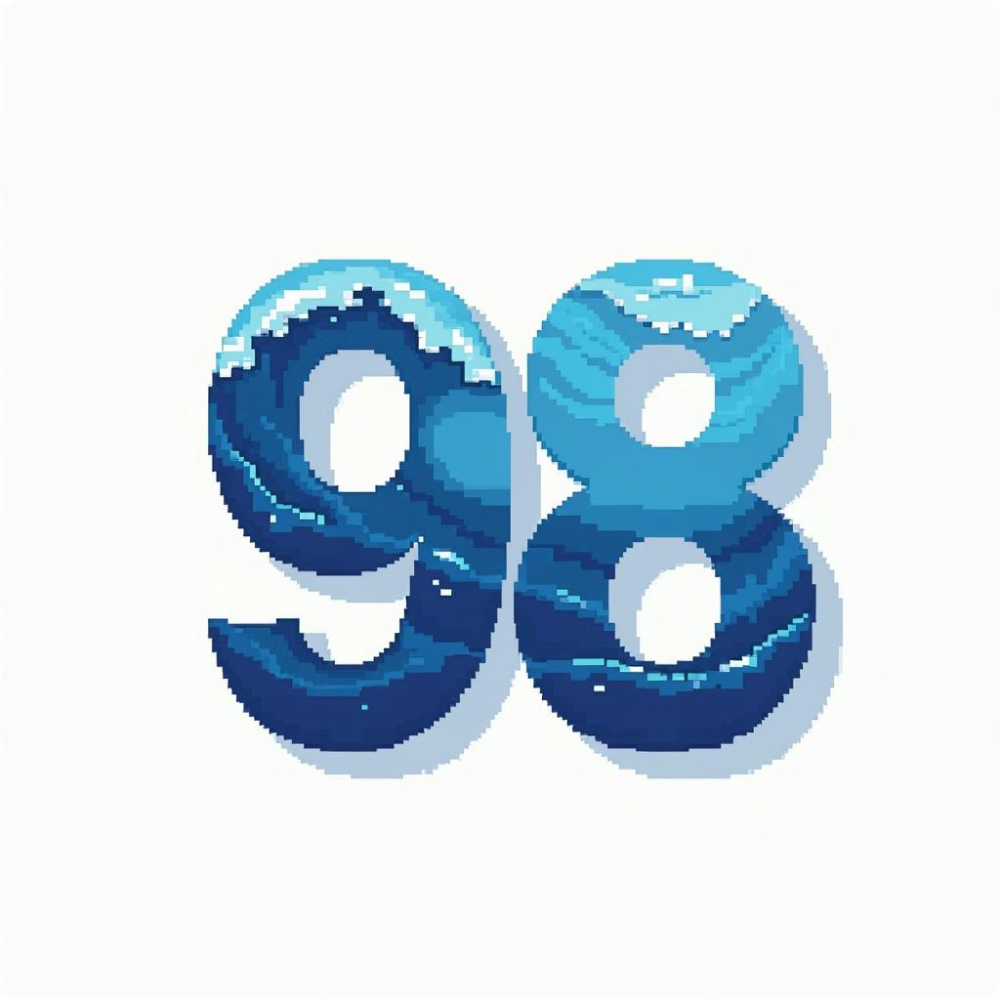

# Ocean98: Extensible Retro-Styled Decentralized Social Experience



## Project Overview
Ocean98 reimagines privacy-first social networking through a nostalgic Windows 98-inspired interface. By combining blockchain technology with retro computing aesthetics, we've created a unique platform that makes decentralized data sharing both secure and intuitive. The environment grows through user-created applications and media tools, all powered by Ocean Protocol DataNFT technology.

## Key Features
- **Ocean Protocol DataNFT based**: Leverages Ocean Protocol DataNFTs to their full potential and showcases what can be done with them.
- **Privacy-First Architecture**: Leverages blockchain technology for secure peer-to-peer data sharing
- **IPFS Integration**: Decentralized storage ensures data permanence and user control
- **Retro UI/UX**: Windows 98-inspired interface providing familiar, intuitive navigation
- **Wallet-Based Access Control**: Granular privacy settings through wallet address permissions
- **DataNFT Creation & Sharing**: Built-in tools for creating and sharing digital assets
- **Friend System**: Secure connection management using wallet addresses

## Technical Innovation
Ocean98 bridges the gap between modern blockchain technology and classic desktop computing. The platform uses:
- Ocean Protocol DataNFTs
- Decentralized storage via IPFS
- Blockchain-based access control
- Privacy-preserving data sharing protocols
- Retro-styled yet fully modern front-end architecture
- LLM-powered content generation system

## User Experience
Users interact with familiar desktop metaphors while leveraging powerful blockchain capabilities:
- Classic window management
- Intuitive file sharing
- Simple friend management
- Seamless DataNFT creation and app deployment
- Nostalgic media playback and gaming

## Vision for the next steps:

### Extensible Environment
- **DataNFT-Based Applications**: Every application in Ocean98 will exist as an DataNFT, enabling:
  - User ownership and trading of applications
  - Community-driven app marketplace
  - Revenue sharing for app creators
- **Retro Media Suite**:
  - Winamp-inspired music player
  - Classic game emulation
  - Vintage chat clients
  - Pixel art creation tools

### AI-Powered Creation
- **LLM Templates**: Users can create new applications using AI-powered templates
- **App Generation**: Convert ideas into functional retro-styled applications
- **Community Sharing**: Distribute created apps as DataNFTs through the network
- **Custom Modifications**: Extend existing apps with new features

## Vision
Ocean98 demonstrates that blockchain technology doesn't have to be intimidating. By wrapping cutting-edge privacy features in a nostalgic interface, we're creating a living, growing ecosystem where users can not only consume content but also create and share their own applications and experiences.

## Installing Ocean98

To install Ocean98, follow these steps:

1. Clone the repository
   ```
   git clone https://github.com/w1kke/ocean-llm.git
   ```
2. Navigate to the project directory
   ```
   cd ocean-llm
   ```
3. Install the dependencies
   ```
   npm install
   ```

## Configuration

1. Create a `.env` file based on `.env.example`
2. Set up your OpenAI API key and Ocean Protocol configuration

### Setting up IPFS with Infura

The application uses Infura's IPFS service for decentralized file storage. To set it up:

1. Create an account at [Infura](https://infura.io)
2. Create a new IPFS project
3. Get your Project ID and API Secret Key
4. Add them to your `.env` file:
   ```
   INFURA_PROJECT_ID=your_project_id
   INFURA_PROJECT_SECRET=your_project_secret
   ```

### Environment Variables

Make sure your `.env` file includes:

```
# OpenAI
OPENAI_API_KEY=your_openai_key

# Ocean Protocol
OCEAN_NETWORK_URL=https://eth-sepolia.g.alchemy.com/v2/your_key
PROVIDER_URL=https://v4.provider.sepolis.oceanprotocol.com
AQUARIUS_URL=https://v4.aquarius.oceanprotocol.com

# Infura IPFS
INFURA_PROJECT_ID=your_infura_project_id
INFURA_PROJECT_SECRET=your_infura_project_secret
```

## Running the Application

1. Start the server
   ```
   npm start
   ```
2. Open your browser and navigate to http://localhost:3000

## Features

- Create AI-generated NFT metadata
- Upload files to IPFS via Infura
- Mint DataNFTs on Ocean Protocol
- Automatic metadata encryption and on-chain storage

## Usage

1. Connect your Web3 wallet (MetaMask recommended)
2. Upload a file using the file upload section
3. Enter your NFT description
4. Click "Create NFT"

The application will:
- Upload your file to IPFS through Infura
- Generate NFT metadata using AI
- Create a DataNFT with the file's IPFS URL
- Encrypt and store the metadata on-chain

## Transaction Requirements

The application requires ETH for two transactions:
1. NFT Creation: 0.001 ETH
2. Metadata Encryption: 0.001 ETH

Make sure your wallet has sufficient ETH (at least 0.003 ETH recommended) to cover:
- Transaction values (0.002 ETH total)
- Gas fees
- Buffer for potential retries

## File Upload Process

When you upload a file:
1. The file is sent directly to IPFS through Infura's API
2. An IPFS hash (CID) is generated
3. An IPFS URL is created in the format: `https://ipfs.io/ipfs/{hash}`
4. The URL is included in the NFT metadata

## Troubleshooting

If you encounter issues:

1. Check your `.env` file has all required variables
2. Ensure your Infura credentials are correct
3. Check the console for any error messages
4. Make sure you're connected to the correct network in MetaMask
5. Verify you have enough ETH for transaction values and gas fees

For IPFS specific issues:
- Verify your Infura project is active
- Check if the IPFS service is enabled in your Infura project
- Test your credentials using the Infura API directly
- Ensure your file size is within limits (50MB max)

For transaction issues:
- Ensure your wallet has sufficient ETH (0.3 ETH recommended)
- Check that you're on the Sepolia network
- Wait for each transaction to be confirmed before proceeding
- Monitor transaction status in MetaMask

## Security Notes

- Your Infura credentials are sensitive - never commit them to version control
- The .env file is listed in .gitignore to prevent accidental exposure
- Files are uploaded directly to IPFS without storing them on the server
- All IPFS URLs are public and permanent - be careful what you upload
- Transaction values are required for contract interaction - ensure sufficient funds
